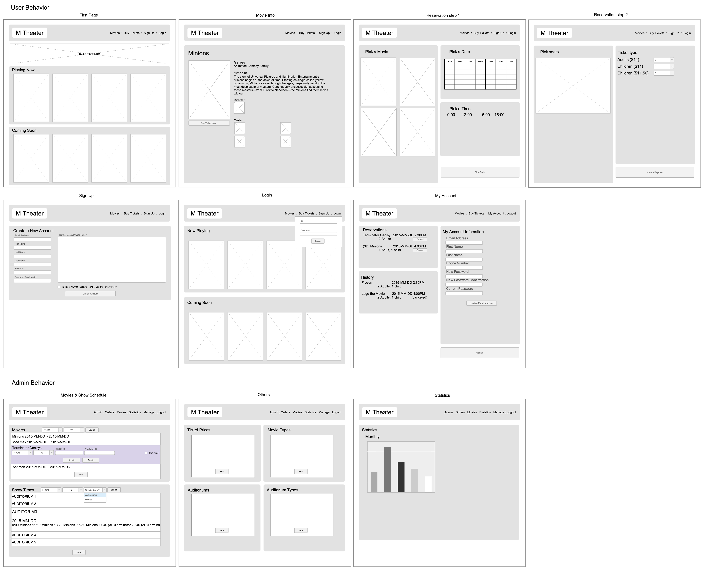
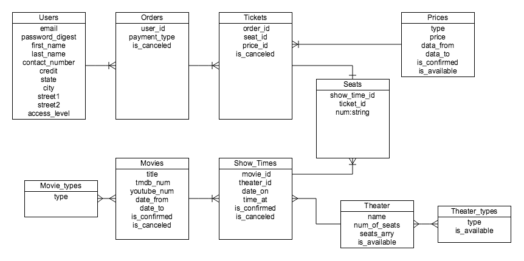

#Welcome to M-Theater!
M-Thater is a pretend theater app.<br>
as a customer, you can signup, login, buy tickets, cancel tickets and see purchase history.<br>
as a admin, you can add movies, make schedules, manage prices and so on.<br>
<br>
##Wire Frame
<br>
"right click" -> "open image on new tab" to see original size image(google chrome)<br>

##ERD
<br>

##User stories
as an anybody,
```
when I land on the homepage, I want to click a login menu, so I can start a session.
```
<br>
as a customer,
```
when I land on the homepage, I want to see event banner, so I can find special deals.
when I land on the homepage, I want to click a movie, so I can read more details/buy tickets.
when I land on the homepage, I want to click buy ticket menu, so I can start reservation process.
when I land on the homepage, I want to click my account menu, so I can change my account info.
when I land on the homepage, I want to click my account menu, so I can see my reservations/historys
when I land on the movie page, I want to click buy ticket button, so I can start reservation process.
when I land on the my account page, I want to click cancel button, so I can cancel my reservations.
when I land on the my account page, I want to find update form, so I can update my account info.

```
<br>
as an admin,
```
when I land on the homepage, I want to redirect to movies&show times page, so I can manage movies and show times.
when I land on the homepage, I want to click manage menu, so I can manage ticket prices and theaters
when I land on the homepage, I want to click statistics menu, so I can see statistics.
when I land on the homepage, I want to click order menu, so I can see costumer's orders.

```
<br>
